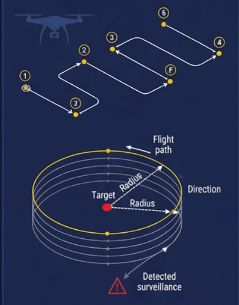
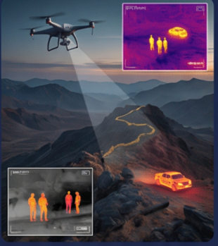
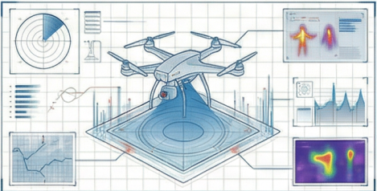
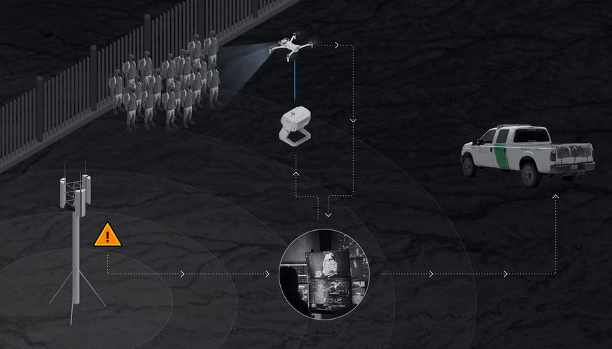

# Border Patrol Drone System

An autonomous drone-based border surveillance system that combines AI object detection with autonomous flight to detect and track people and vehicles crossing borders.

---

## Project Images

### Patrol Pattern


### Thermal Detection


### System Overview


### Border Surveillance System


---

## Demo Video

[Watch Demo Video](assets/demo.webm)

---

## Project Overview

This project simulates a real border patrol system using:
- Autonomous drone patrol along a defined border route
- AI detection to identify people and vehicles
- Real time alerts sent to border guards
- Orbit maneuver when suspicious activity is detected

---

## System Architecture

```
Drone takes off from home position
         ↓
Flies patrol route along the border
W1 → W2 → W3 → W4 → W5 → W6 → W7
         ↓
At W4 — suspicious activity detected
Mission paused — drone performs 50m radius orbit
         ↓
AI detection runs on camera feed
         ↓
Alert sent to border guards
         ↓
Mission resumes — drone returns to base
```

---

## Project Structure

```
border-patrol-drone/
├── README.md
├── requirements.txt
├── drone/
│   └── patrol_mission.py
├── ai/
│   └── border_detection.py
└── assets/
    ├── patrol_pattern.png
    ├── thermal_detection.png
    ├── system_overview.png
    ├── border_system.png
    └── demo.webm
```

---

## Technologies Used

| Technology | Purpose |
|---|---|
| Python 3.10 | main programming language |
| MAVSDK | drone communication and control |
| PX4 SITL | drone simulation with Gazebo |
| asyncio | async drone control |
| YOLOv8m | AI object detection model |
| OpenCV | image processing and visualization |
| PyTorch | deep learning framework |
| CUDA 12.4 | GPU acceleration |

---

## Hardware Specifications

| Component | Details |
|---|---|
| CPU | AMD Ryzen 7 7435HS |
| GPU | NVIDIA GeForce RTX 4050 Laptop GPU |
| RAM | 16GB |
| OS | Ubuntu 22.04 |
| CUDA | 12.4 |

---

## Installation

### Clone the repository
```bash
git clone https://github.com/Ziyadalshrani507/border-patrol-drone.git
cd border-patrol-drone
```

### Install dependencies
```bash
pip install -r requirements.txt
```

### Install PyTorch with CUDA
```bash
pip install torch torchvision torchaudio --index-url https://download.pytorch.org/whl/cu124
```

---

## How to Run

### Step 1 — Set home location
```bash
export PX4_HOME_LAT=18.708306
export PX4_HOME_LON=49.963417
export PX4_HOME_ALT=650
```

### Step 2 — Start PX4 SITL simulator
```bash
make px4_sitl gazebo
```

### Step 3 — Run drone patrol mission
```bash
python3 drone/patrol_mission.py
```

### Step 4 — Run AI detection system
```bash
python3 ai/border_detection.py
```

---

## Patrol Route

| Waypoint | Latitude | Longitude | Notes |
|---|---|---|---|
| Home | 18.708306 | 49.963417 | takeoff point |
| W1 | 18.708306 | 49.963900 | patrol start |
| W2 | 18.708280 | 49.964400 | patrol east |
| W3 | 18.708270 | 49.964900 | patrol east |
| W4 | 18.708260 | 49.965400 | orbit + AI detection |
| W5 | 18.708250 | 49.965900 | patrol continue |
| W6 | 18.708250 | 49.966400 | patrol east |
| W7 | 18.708250 | 49.966667 | patrol end |

---

## AI Detection Classes

| ID | Object | Box Color |
|---|---|---|
| 0 | Person | Green |
| 2 | Car | Orange |
| 5 | Bus | Purple |
| 7 | Truck | Yellow |
| any | Crossed border | Red |

---

## Border Guard Alert Example

```
==================================================
BORDER GUARD ALERT
==================================================
Time       : 2026-05-30 12:00:01
Location   : W4 — border crossing hotspot
Lat        : 18.708260
Lon        : 49.965400
People     : 5 detected crossing the border
Vehicles   : 1 car detected crossing the border
Status     : IMMEDIATE ACTION REQUIRED
==================================================
```

---

## Challenges Faced

| Challenge | Fix |
|---|---|
| UDP connection deprecated | changed to udpin://0.0.0.0:14540 |
| Drone arming denied | added health check before arming |
| GPU not working Error 804 | updated NVIDIA driver to 570 |
| Border line wrong position | added live slider to adjust |
| Detection direction wrong | flipped crossing logic |
| Low confidence on drone footage | lowered threshold to 0.05 |
| Display broke after driver update | restarted gdm3 |

---

## Future Improvements

- Train custom YOLOv8 model on aerial drone footage
- Integrate live camera stream from real drone
- Add GPS coordinates to each detection alert
- Send real time SMS or email alerts to border guards
- Deploy on actual drone hardware
- Add night vision thermal model for better accuracy
- Add web dashboard for live monitoring

---

## Author

**Ziyadalshrani507**
Engineering Student — Border Patrol Drone Surveillance System
